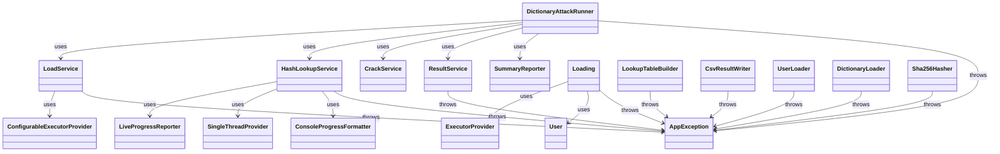

classDiagram
%% Package: org.example.app
subgraph "org.example.app"
class DictionaryAttackApp {
+main(String[] args)$
}

        class AppFactory {
            -hasher: Hasher
            -writer: ResultWriter
            -cracker: Crack
            -summaryReporter: SummaryReporter
            +AppFactory(Hasher, ResultWriter, Crack, SummaryReporter)
            +AppFactory()
            +createRunner(): DictionaryAttackRunner
        }

        class DictionaryAttackRunner {
            -dataLoader: LoadService
            -hashLookupService: HashLookupService
            -crackService: CrackService
            -resultService: ResultService
            -summaryReporter: SummaryReporter
            +DictionaryAttackRunner(Loading, HashLookupBuilder, Crack, ResultWriter, SummaryReporter)
            +run(String, String, String): void
        }

        DictionaryAttackApp --> AppFactory : uses
        AppFactory --> DictionaryAttackRunner : creates
    end

````

```mermaid
classDiagram
    %% Package: org.example.model
    subgraph "org.example.model"
        class User {
            -username: String
            -hashedPassword: String
            -found: boolean
            -foundPassword: String
            +User(String, String)
            +getUsername(): String
            +getHashedPassword(): String
            +isFound(): boolean
            +getFoundPassword(): String
            +markFound(String): void
            +equals(Object): boolean
            +hashCode(): int
        }
    end
````

```mermaid
classDiagram
    %% Package: org.example.error
    subgraph "org.example.error"
        class AppException {
            +AppException(String)
            +AppException(String, Throwable)
        }
    end
```

```mermaid
classDiagram
    %% Package: org.example.service
    subgraph "org.example.service"
        class CrackService {
            -cracker: Crack
            +CrackService(Crack)
            +crackAll(Set~User~, Map~String, String~): long
        }

        class HashLookupService {
            -builder: HashLookupBuilder
            +HashLookupService(HashLookupBuilder)
            +buildWithProgress(Set~String~): Map~String, String~
        }

        class ResultService {
            -writer: ResultWriter
            +ResultService(ResultWriter)
            +write(String, Set~User~): void
        }

        class LoadService {
            -loadService: Loading
            +LoadService(Loading)
            +load(String, String, int): Loading.LoadedData
        }

        CrackService --> Crack : uses
        HashLookupService --> HashLookupBuilder : uses
        ResultService --> ResultWriter : uses
        LoadService --> Loading : uses
    end
```

```mermaid
classDiagram
    %% Package: org.example.loader
    subgraph "org.example.loader"
        class Loading {
            -userLoader: Loader~User~
            -dictLoader: Loader~String~
            +Loading(Loader~User~, Loader~String~)
            +load(String, String, ExecutorProvider): LoadedData
        }

        class Loading.LoadedData {
            +users: Set~User~
            +dict: Set~String~
        }

        class UserLoader {
            +load(String): Set~User~
        }

        class DictionaryLoader {
            -words: Set~String~
            +load(String): Set~String~
        }

        class Loader~T~ {
            <<interface>>
            +load(String): Set~T~
        }

        Loading --> Loader : uses
        UserLoader --> Loader : implements
        DictionaryLoader --> Loader : implements
    end
```

```mermaid
classDiagram
    %% Package: org.example.cracktask
    subgraph "org.example.cracktask"
        class CrackTask {
            +crack(Collection~User~, Map~String, String~, AtomicLong): void
        }

        class Crack {
            <<interface>>
            +crack(Collection~User~, Map~String, String~, AtomicLong): void
        }

        CrackTask --> Crack : implements
    end
```

```mermaid
classDiagram
    %% Package: org.example.store
    subgraph "org.example.store"
        class LookupTableBuilder {
            -hasher: Hasher
            +LookupTableBuilder(Hasher)
            +buildHashLookupTable(Set~String~, AtomicLong): Map~String, String~
        }

        class HashLookupBuilder {
            <<interface>>
            +buildHashLookupTable(Set~String~, AtomicLong): Map~String, String~
        }

        LookupTableBuilder --> HashLookupBuilder : implements
        LookupTableBuilder --> Hasher : uses
    end
```

```mermaid
classDiagram
    %% Package: org.example.hash
    subgraph "org.example.hash"
        class Sha256Hasher {
            +hash(String): String
        }

        class Hasher {
            <<interface>>
            +hash(String): String
        }

        Sha256Hasher --> Hasher : implements
    end
```

```mermaid
classDiagram
    %% Package: org.example.io
    subgraph "org.example.io"
        class CsvResultWriter {
            +write(String, Collection~User~): void
        }

        class ResultWriter {
            <<interface>>
            +write(String, Collection~User~): void
        }

        CsvResultWriter --> ResultWriter : implements
    end
```

```mermaid
classDiagram
    %% Package: org.example.reporter
    subgraph "org.example.reporter"
        class ConsoleSummaryReporter {
            +printSummary(long, long, long, long): void
        }

        class ConsoleProgressFormatter {
            +format(long, long): String
        }

        class LiveProgressReporter {
            -counter: AtomicLong
            -total: long
            -latch: CountDownLatch
            -formatter: ProgressFormatter
            +LiveProgressReporter(AtomicLong, long, CountDownLatch, ProgressFormatter)
            +run(): void
        }

        class SummaryReporter {
            <<interface>>
            +printSummary(long, long, long, long): void
        }

        class ProgressFormatter {
            <<interface>>
            +format(long, long): String
        }

        ConsoleSummaryReporter --> SummaryReporter : implements
        ConsoleProgressFormatter --> ProgressFormatter : implements
        LiveProgressReporter --> ProgressFormatter : uses
    end
```

```mermaid
classDiagram
    %% Package: org.example.threads
    subgraph "org.example.threads"
        class ConfigurableExecutorProvider {
            +ConfigurableExecutorProvider(Supplier~ExecutorService~)
            +fixedCpuPool(): ConfigurableExecutorProvider
            +fixedCpuPool(int): ConfigurableExecutorProvider
            +cachedPool(): ConfigurableExecutorProvider
        }

        class SingleThreadProvider {
            +SingleThreadProvider()
            +submitTask(Runnable): void
        }

        class ExecutorProvider {
            #executor: ExecutorService
            +ExecutorProvider(ExecutorService)
            +get(): ExecutorService
            +close(): void
        }

        ConfigurableExecutorProvider --> ExecutorProvider : extends
        SingleThreadProvider --> ExecutorProvider : extends
    end
```


